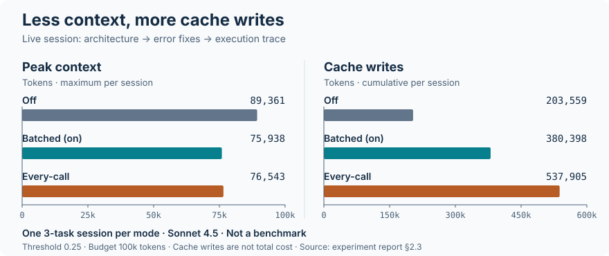

# pi-jev-prune

[pi](https://github.com/earendil-works/pi) extension that replaces stale tool results with recoverable stubs, using [TypeSafe's Jev](https://typesafe.ai) and a superseded-read rule.

**Experimental; not ready for general use. Don't add it to your main workflow yet.**
Defaults to `dry`: evaluates and logs decisions without replacing tool results.

## Install

Requires **pi ≥ 0.86** and `TYPESAFE_API_KEY` for Jev judgments.

```bash
pi install npm:pi-jev-prune
export TYPESAFE_API_KEY="your-key"
```

Without the key, the superseded-read rule still runs and can prune in `on` mode.
Original tool results remain in the session; the model can retrieve them with `recall(toolCallId)`.

## Usage

- `/prune status` — mode, usage, and diagnostics.
- `/prune show` — individual decisions.
- `/prune dry|on|off` — change mode for this session.
- `/prune now` — force a decision window on the next LLM call.

Persistent settings go under `jev-prune` in `~/.pi/agent/settings.json`:

```json
{
  "jev-prune": {
    "mode": "dry",
    "budget": 100000,
    "threshold": 0.25
  }
}
```

Merge this into existing settings. `budget` is the token reference for pruning triggers, not a hard context limit.
Decisions are logged to `~/.pi/agent/jev-prune/log.jsonl`.
See [configuration, decision rules, and limitations](docs/configuration.md).

## Results

**More context headroom, not proven cost savings.** Peak context fell 15% in one three-task session.



One three-task session per mode on Sonnet 4.5—not a benchmark. Batched = `on`; cache writes are not total cost.

Exploratory results from 14 replayed sessions and 13 live runs—not a general benchmark or safety guarantee.

[Visual report](https://fsmiamoto.github.io/pi-jev-prune/) · [Full experiment report](experiments/REPORT.md)

## Development

See [CONTRIBUTING.md](CONTRIBUTING.md) for tests, experiments, and releases.

[MIT](LICENSE)
